# ARC-AGI-2 results
## Training Loss
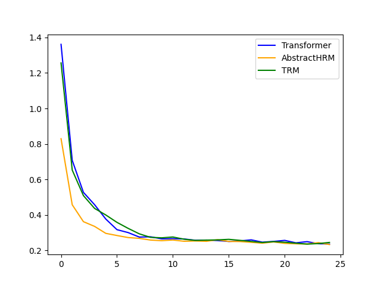
## Evaluation Loss
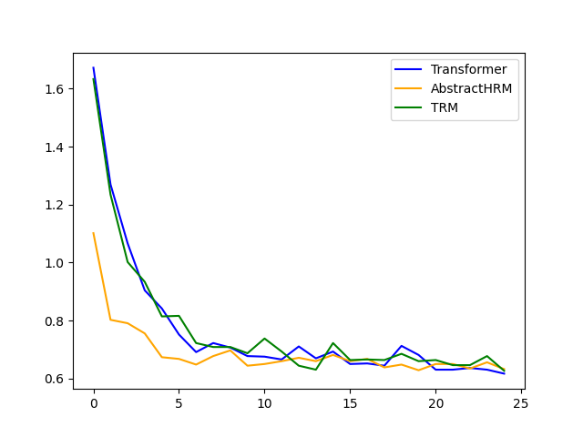
## Training Accuracy
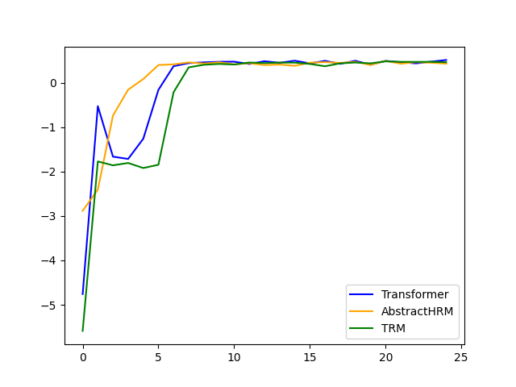
## Evaluation Accuracy
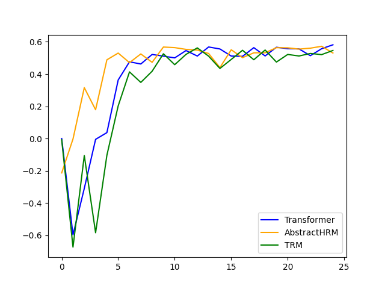

 

# Latent values decoded:

<table>
<tr>
<th>Input</th><th>Target</th><th>Output</th><th>Combined</th><th>Embed</th>
</tr>
</table>

Transformer

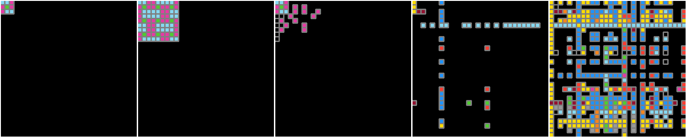

TRM

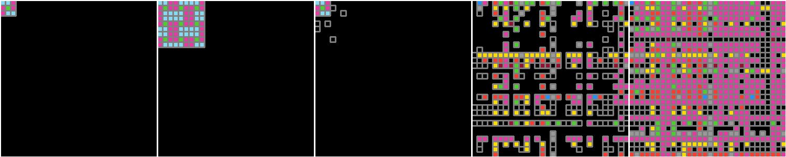

AbstractHRM

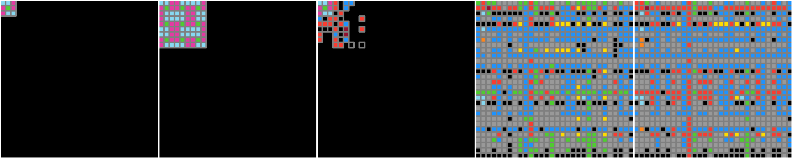

 

As we go from Transformer to TRM to AbstractHRM, the less is the embedding and the example grid combiner close to the solution, which means the more is the thinking module utilized.

 

# Losses in output synchronization:

Checking if model <b>A</b> can learn model <b>B</b>'s behaviour better while model <b>B</b> is learning model <b>A</b>'s behaviour. If it does, then it means that model <b>A</b> has more adaptive freedom, while model <b>B</b> has more of an inductive bias, a fixed characterstic that cannot adapt.

### AbstractHRM vs Transformer
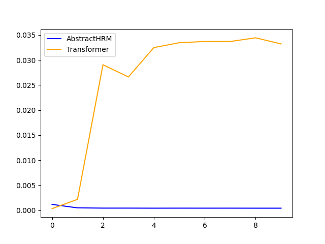
### AbstractHRM vs TRM
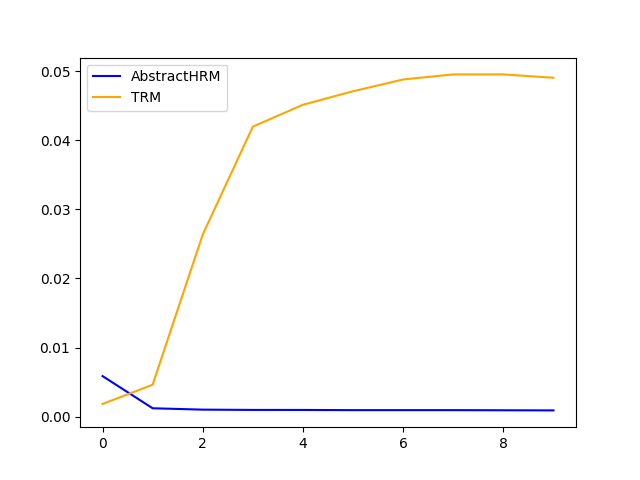

In both cases my model's loss decreases then stabilizes, while the other models loss increases. This means that my model can learn these models behaviour, while they can't learn my model's behavior. This indicates that my model has less of an inductive bias, and more adaptive capacity.

### Transformer vs TRM
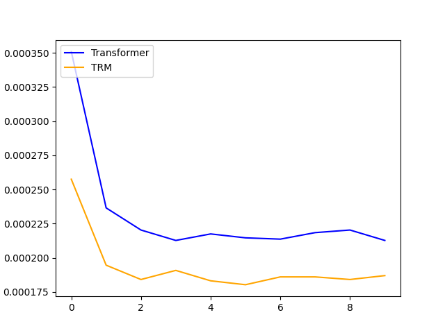

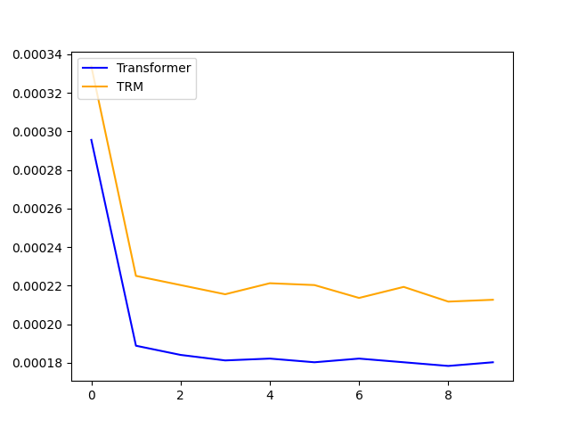

It is inconsistent which model is the winner. This indicates that there is very little difference in their adaptive capacity.

### AbstractHRM vs AbstractHRM
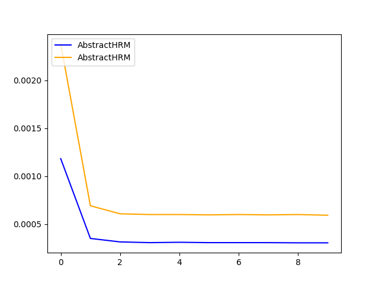

This further proves that models that are very similar in adaptive capacity show this kind of tendency, where both losses decrease then stabilize, since in this case there is no difference in these models, just their random initialization.